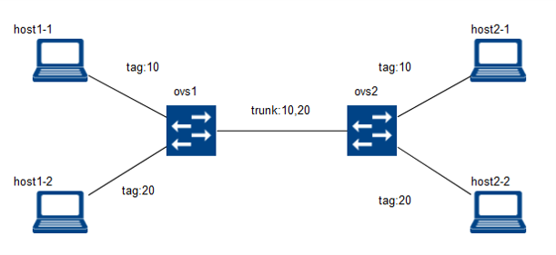

# netns-dev
basic vlan switching for netns and openvswitch



# how to run
```
$ vagrant up
$ ssh vagrant@localhost:2222
password > vagrant
$ sudo su
$ ./scripts/create-ns1.sh
```

# how to ping
```
$ ssh vagrant@localhost:2222
password > vagrant

// host1-1 to host2-1. ping OK
$ ip netns exec host1-1 ping 192.168.100.21

// host1-1 to host1-2. ping NG
$ ip netns exec host1-1 ping 192.168.100.12
```
